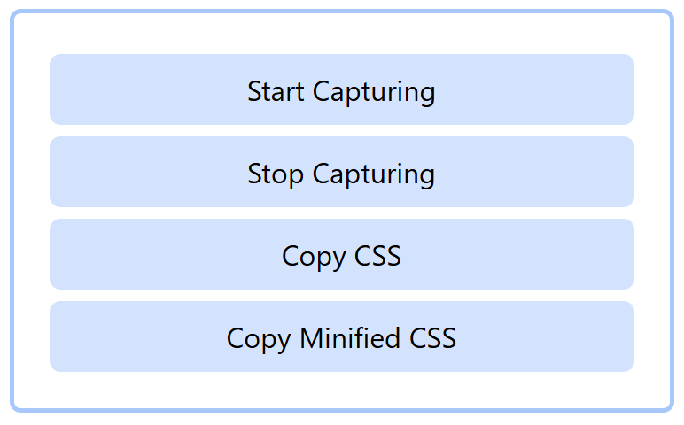
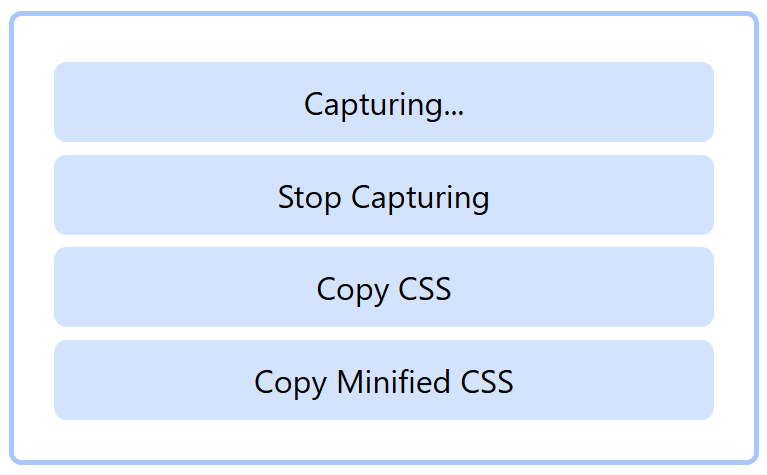

# tailwindcss-browser-based-builder

A **browser-based build tool for Tailwind CSS** that lets you generate your Tailwind CSS output **directly in the browser** — no Node.js or build setup required.

---

## 🚀 Features

* Build Tailwind CSS styles entirely in the browser
* No need for Node.js or any external build tools
* Works across multiple HTML pages
* Supports copying both **unminified** and **minified** CSS outputs

---

## 🧩 Usage

1. **Add the scripts**
   Include the two provided script tags on every page whose Tailwind classes you want to capture.

    ```html
    <script src="https://cdn.jsdelivr.net/npm/@tailwindcss/browser@4"></script>
    <script src="tailwind-builder.js" defer></script>
    ```

2. **Capture Tailwind classes**
   Once the scripts are added, start the capture process.

   <p align="center">
    
   </p>
  
   Visit each page that should contribute its Tailwind classes to the final stylesheet.

3. **Export the CSS**
   When you’re done capturing, click **Copy CSS** or **Copy Minified CSS** to copy the compiled Tailwind output.
   <p align="center">
    
   </p>

---

## ⚠️ Important Notes

* This tool works **best with static pages** or sites where all Tailwind classes are already present in the DOM.
* For **highly dynamic web apps** (that add or remove elements at runtime), some Tailwind classes may not be captured — since this tool only detects classes that exist in the DOM at capture time.
* If your project dynamically injects new Tailwind classes, it’s recommended to:

  * Use a proper Tailwind build setup (via Node.js), or
  * Generate all possible class variants manually while capturing.

---

## 🧠 Supported Tailwind CSS Versions

* Tailwind CSS **v3**
* Tailwind CSS **v4**

---

## 📝 Example

After including these on your pages, start the capture process in the browser interface, visit all relevant pages, and copy your generated CSS.

---

## Browser Support

Works in all modern browsers that support ES modules.

## License

MIT © Ma Px

## Contributing

Contributions are welcome! Please feel free to submit a Pull Request.

## Issues

If you encounter any problems, please file an issue along with a detailed description.
